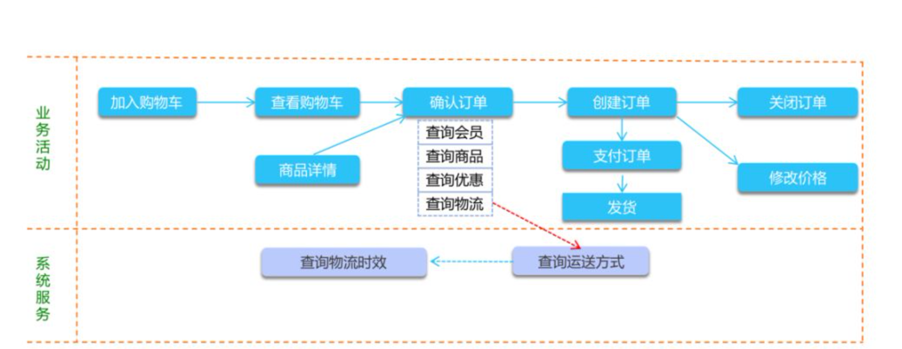
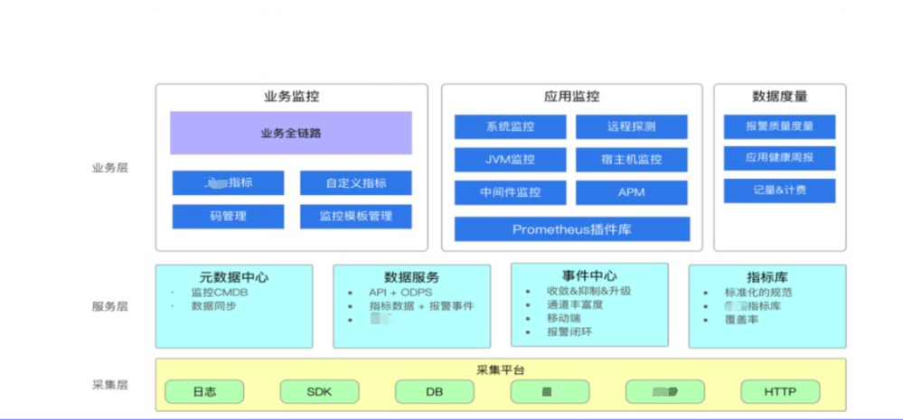
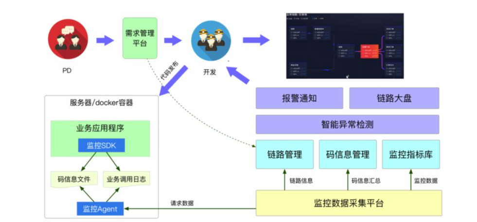
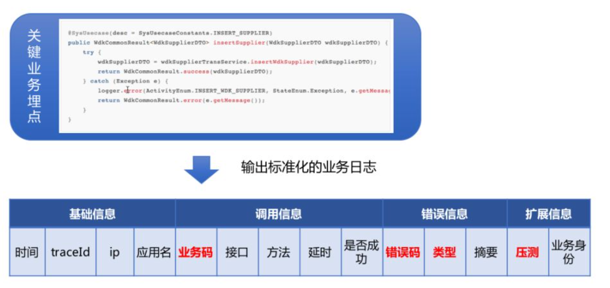
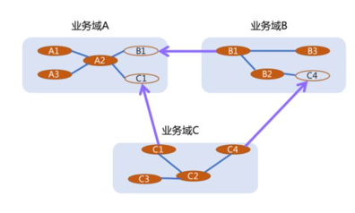
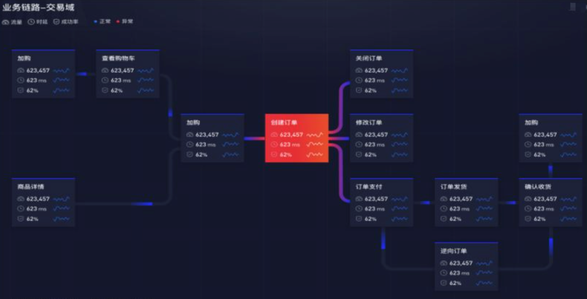

#1. 背景
近年来，随着我们新业务的快速发展，传统的业务监控大盘已经不能满足监控需求：

- 缺乏全局视角：目前监控大盘主要反映的是单个业务或应用的运行状态，缺少全局的业务视角能反应整个业务域的上下游整体的运行情况。比如交易系统成功率下跌，想看看是不是营销出问题了，但是不知道营销的业务监控在哪里，只能依赖优惠的同学去排查，上下游协调成本很高。
- 监控标准不统一：一直以来业务监控都是自定义的，依赖开发人员的个人经验，往往系统、业务监控混在一起，没有标准，业务之间不能比较；各系统监控能力参差不齐，很容易出现业务链路中的监控断层；新人或者新业务对于业务要怎么监控，不知道如何下手、不知道自己配的监控是否覆盖全面，只有等到故障发生以后才去补监控。
- 缺少业务视角：随着中台的建设，使得传统的监控已经不能满足需求，比如一个交易中台业务就会有数个业务方调用，大业务量监控会把小调用量的业务淹没，必须按每个业务方的业务身份进行监控。
- 监控配置成本高：业务监控一直都是由开发人员纯手工打造，需要经过日志埋点、监控配置、报警阈值设置，整个过程费时费力，缺乏自动化监控的手段，这也是造成各系统监控能力参差不齐的重要原因，一些新业务因为无力投入大量精力配置监控，导致业务监控能力缺失。

#2. 业务全链路监控
## 2.1 目前监控存在的问题
一开始我们的监控系统都是针对单个应用的，比如说交易的开发只关心交易指标是是否正常，优惠的同学只关心自己系统的健康状况，他们各自配置数据大盘，报警。

一旦出现问题，大家只能在群里面问，或者语音会议，互相讨论，定位到底是谁出了问题。

同时上层的领导更加着急，因为他看不到整整体情况，就只能挨个问情况。所以单系统监控的问题就是看不到全景，上下游协同成本非常之高；而系统的监控能力是依赖于开发人员自己的素养，能力高一点的，监控完善一些，技能不足或者意识不够的可能就是空白。

后来有全链路trace的监控出来，它主要解决的是如何做系统间链路排查，这样从原来完全看不到全景，发展到可以看一部分系统调用链路上面的情况。

但是全链路trace监控也存在一些不足！
- 首先，那它是没有业务含义的，就比如说我们中台交易的业务，其实服务于很多业务方，每个业务方调用都是调用同一个API，在系统链路里只能看到总量，比如我们拿我们的便利购来说，系统链路就看不出问题，因为便利购在整个交易里面量会占的比较小，总量的波动也很小。
- 其次，系统链路的细节太多，缺乏对强弱依赖的梳理，导致整个链路形如蛛网，反而看不清全局。
## 2.2 全链路业务监控
全链路的业务监控，就是要从业务的视角出发，监控整个业务流程的健康状况，无需多个系统切换，直观看到全局和上下游，方便快速发现、定位问题。

这就需要建立完整的业务监控模型，为业务建立起一个从宏观到微观的全景式业务监控体系，彻底解决业务监控没有标准，只能纯手工打造的历史。业务监控模型主要包括3部分：
 
  

    
  

- 业务域：一个完整的业务域或产品称为业务域，如电商里面的交易域、营销域、支付域。
- 业务活动：业务域中的的核心业务用例叫做业务活动，如交易域的下单确认、创建订单等，业务活动是整个监控模型的核心，每个业务活动都会有标准的指标来反应自身的健康状况，业务活动之间建立上下游关系就形成了业务链路。
- 系统服务：业务活动中的依赖的关键方法我们叫做系统服务，如下单确认包含：查询会员、查询商品、查询优惠等关键方法，每个系统服务也通过指标来表示其健康状况。

  

    
  

如上图所示，最底层是数据采集，所有的数据都会在这里被处理，上面是各个服务层，包括我们的元数据中心，以及对外提供数据的服务，事件中心包括报警事件查询，通知规则定义等等，最后一个是我们的整个监控指标库，所有监控指标都要落到这里统一管理。

业务层主要分成两部分：
- 一是应用监控，应用监控里面主要是一些基础的标准化的监控。
- 二是业务监控，原来主要是靠用户自定义，缺少标准和对数据有效组织，以后更多的会以业务全链路作为一个入口，把所有的业务指标以及后面的应用监控来串联起来。

## 2.3 如何做全链路的监控
- 1.梳理关键业务：业务方需要梳理出自己的核心业务是什么，即业务活动，以及这些核心业务的关键依赖有哪些，即系统服务。
- 2.监控数据埋点：提供了无侵入的配置化监控SDK，只要将业务活动和系统服务对应的方法填写到配置文件中，系统会自动收集，计算，上报监控数据。
- 3.监控链路：系统根据收集的数据自动生成业务链路，每个业务活动和系统服务节点都自动生成流量、耗时、成功率的指标，同时每个节点都可以通过钻取查看详细的监控数据，包括：不同机房、分组的数据对比，每个业务身份的明细调用情况等。
- 4.异常检测：业务链路涉及节点众多，必须要有完善的异常检测机制来帮助用户自动发现问题，我们提供了基线预警和自定义规则预警相结合的异常检测机制，无需用户逐个配置报警规则，自动发现异常节点，实时将这些节点标红处理，异常的详细信息也会同步显示，方便用户快速发现和定位问题。

## 2.4 非研发也能随时了解业务状况

  

    
  

通过业务全链路监控，可以做到对业务域的监控标准化和全覆盖，避免了自定义监控覆盖不全面、不标准、配置工作量大的问题，使得老板、PD、运营、监控值班等用户都可以快速了解业务是否有问题。

# 3 怎么确定当前业务是否有问题

这里套用Google的黄金指标概念
- 流量 ：业务在单位时间内的调用量，如：服务的QPS、每秒订单笔数等。
- 耗时 ：业务的具体处理时长，需区分成功耗时和失败耗时。
- 错误 ：调用出错数量、成功率、错误码。
- 饱和度 ：应用已使用资源的占比。
由于饱和度更多反应的是应用的层面情况，所以业务监控使用流量、耗时、错误这三个指标就能很好的回答业务是否健康的问题，在业务全链路监控中每个业务活动和系统服务都会标配这三个监控指标。

除了黄金指标以外，还可以根据各自业务的不同特点，定义各种分维度的辅助指标，比如：按不同的业务身份，按商家、按门店分，不同的错误码等等，用于进一步细化和定位问题。

因此，前面我们已经确定了业务域、业务活动和系统服务三层业务模型，再通过黄金指标来描述这些业务模型的监控状况，这样我们就能量化清楚一件事情：业务是否健康。

# 4 数据采集

监控SDK使用切面自动实现了配置化埋点能力，业务系统引入监控SDK后，通过简单的一个配置文件即可完成监控埋点，自动完成数据的拦截、计算、上报，与业务代码完全解耦。

自动生成核心链路、黄金指标、下钻的业务维度大盘，无需用户配置，用户还可以通过可视化编辑页面对链路进行调整。

- 业务码：用来表示这行日志是属于哪个一个业务域，哪个业务活动或者系统服务。
- 错误码：错误信息里面最重要的是错误码，产生了一次错误以后到底是什么样的错误就全靠错误码进行区分，这样你在做定位的时候才能有的放矢。
- 错误类型：错误一定要分类型，大致分为这么两类。一类是用户级的错误，一类是系统级的错误。 
  - 对于用户级的错误，比如用户登录的时候密码输入出错了，这些错误是已知道的，对整个系统是不会产生影响的，它是属于业务日常错误里的一部分，你需要在做监控的时候把这些错误排除掉，要不然你整个成功率指标就失准了。
- 扩展信息：扩展信息里输出的是每个业务特有的维度，比如业务方，商家名称等，比较通用的是一个压测标识，记录这条数据是真实流量还是压测请求。

  

    
  

# 4 存储
对于监控存储，我们所有的数据格式化以后，就会存储到监控数据库里，在这里我们把监控数据全部标准化，数据存储到tidb里面，一个高性能的时许数据库。

# 5 和其他监控配合
业务链路监控发现异常以后，就需要对异常做更加精确的定位，最主要的是两大平台。

- 第一个是全链路追踪系统，原理和Dapper类似，主要做系统Trace链路排查。
- 第二个是我们自研的日志系统，是一个日志的异常诊断的一个工具，我们的日志里边肯定会很多的错误堆栈，各种错误信息，系统通过一种比较智能化的手段对错误进行分析和归类，统计每种错误的出现时间、次数、类型和原始样本等信息，帮我们找出应用里面有哪些错误是比较高危，哪些错误是最近新产生的，这样能快速帮助我们定位问题。

# 6 跨部门监控
在业务链路监控中，跨部门链路监控一直是个难题，业务全链路路监控通过黄金指标+业务维度来解决这个难题。

每个部门把直接对外提供服务的核心业务梳理出来，并设定它的黄金指标，我们设定这样的黄金指标为这个部门的SLA指标，其它部门的系统调用这个业务时，就看这些SLA的指标是否正常，而不再关心这个业务的内部调用细节。

一般这样的业务调用方很多，我们通过一个业务身份的维度来对这些SLA指标进行细分，每个业务身份会有独立的SLA指标数据，调用方只看自己的业务身份对应的监控数据即可判断对方业务是否正常。

每个部门都定义自己的对外核心业务和SLA指标，相互之间通过数据说话，形成一种标准化的服务能力评价体系，随着这个体系的不断推进，业务全链路可以把各个部门的业务节点串联起来，组成一个更大的大网，在这个里面每个部门都对外暴露的自己的关键业务，每个关键业务通过黄金指标量化服务能力，这样就可以快速定位到底是谁的问题，建立起一个正在的全景式监控。

  

    
  

# 7 实例
我们通过一个交易链路实例来看一下效果，链路中列出交易域的关键业务，也就是交易对其它部门提供的核心服务，省略了每个业务的系统服务等细节，整个链路可以通过业务身份来过滤不同调用方的调用情况，通过智能检测程序实现对每个调用方的SLA监控，一旦出现异常会通过钉钉、短信等消息通知用户，并将节点标记为异常。

每个业务节点都可以查看更详细的业务活动大盘，它是业务异常排查的一个总的入口，整合了这个业务活动的所有业务指标，关联应用的系统指标，以及系统调用的链路等等信息。

  

    
  

